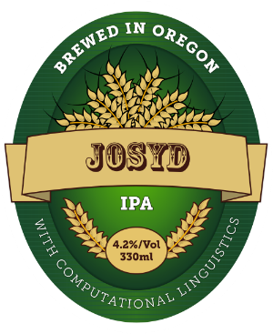

# Joint Syntactic and Discourse Parsing



This repository contains the implementation of the joint syntaco-discourse parser and the syntaco-discourse treebank. For more details, please refer to the paper [Joint Syntacto-Discourse Parsing and the Syntacto-Discourse Treebank](http://aclweb.org/anthology/D/D17/D17-1224.pdf).

### Syntaco-Discourse Treebank

Due to copyright limit, we can not provide the joint treebank in the form that can be directly used to train a parser. Instead, we provide a patch tool kit to generate the Syntaco-Discourse Treebank giving the [RST Discourse Treebank](https://catalog.ldc.upenn.edu/ldc2002t07) and the [Penn Treebank](https://catalog.ldc.upenn.edu/ldc99t42).

Please follow the steps below to generate the parser:

1. Place the RST Discourse Treebank in folder ```dataset/rst```. Put the discourse trees (```wsj_xxxx.out.dis``` files) in the RST Discourse Treebank to ```dataset/rst/train``` and ```dataset/rst/test``` respectively. Here each ```wsj_xxxx.out.dis``` file corresponds to one WSJ article, where ```xxxx``` is the article number.

2. Place the Penn Treebank trees in folder ```dataset/ptb```. These constituency trees are in parentheses format. They are grouped as one treebank file (with name ```wsj_xxxx.cleangold```) for a WSJ article.

3. Generate the training set and testing set for the joint treebank separately:

   ```bash
   josydipa/aligner.py --rst_path dataset/rst/train --const_path dataset/ptb > train.txt
   josydipa/aligner.py --rst_path dataset/rst/dev --const_path dataset/ptb > dev.txt
   ```


### Syntaco-Dsicourse Parser

To be finished.
